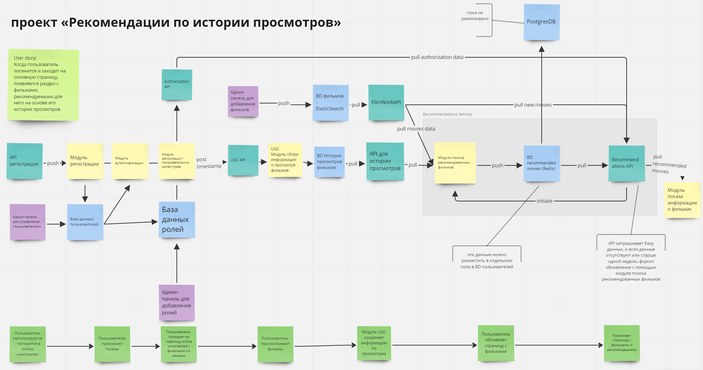

# Проектная работа: диплом

У вас будет один репозиторий на все 4 недели работы над дипломным проектом. 

Если вы выбрали работу в командах, ревью будет организовано как в командных модулях с той лишь разницей, что формируете состав команды и назначаете тимлида вы сами, а не команда сопровождения.

Удачи!


# Как собрать проект
```
git clone git@github.com:DmitryRybko/graduate_work.git;
cd graduate_work;
git clone git@github.com:DmitryRybko/new_admin_panel_sprint_3.git; # ETL and admin_panel
git clone git@github.com:DmitryRybko/Auth_sprint_2.git; # async service and auth service
docker-compose up -d --build;
```
# Общая схема проекта
